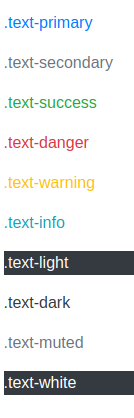

###
# Proyecto de Apuntes del Ciclo Superior de Desarrollo de Aplicaciones 
En el módulo de despliegue de aplicaciones web

## Descripción

Este proyecto contiene los apuntes del módulo **Desarrollo de Aplicaciones Web en Entorno Servidor** del ciclo superior de **Desarrollo de Aplicaciones Web**. Está desarrollado utilizando [Hugo](https://gohugo.io/) y el tema [Docsy](https://www.docsy.dev/) para organizar y presentar los contenidos de manera clara y accesible.

## Módulo: Despliegue de aplicaciones Web
En este módulo se exploran las  tecnologías, herramientas necesarias y consideradas importantes para el despliegue


## Temas

Los apuntes cubren los siguientes temas principales:

1. **Repaso de redes**  
   
2. **Comandos de linux**  
   
3. **Git y github**  

4. **Servicios implicados en la web**  
 
5. **Docker**
 
6. **AWS**  

5. **Laravel**  

6. **Seguridad en Aplicaciones Web**  


## Estructura del Proyecto

El proyecto está organizado en varias secciones, cada una dedicada a un tema del módulo. Los apuntes están escritos en formato Markdown y se organizan en carpetas dentro del directorio `content` de Hugo.

```bash
/
├── content/
│   ├── docker/
│   ├── hugo/
│   ├── php/
│   ├── laravel/
└── themes/
    └── docsy/

```

### Utilidades para el desarrollo

; Colores usados para el texto:

````css
.text-primary
.text-secondary
.text-success
.text-danger
.text-warning
.text-info
.text-light
.text-dark
.text-muted
.text-white
````
*Para ver los colores:
````html
* primary
* secondary
* success
* danger
* warning
* info
* light
* dark
* dark
* muted
* muted
* white

````

### Pendientes

La fuente de iconos que he creado no se ve    

Debe de tener que ver con la clase before de css . 


Atribuciones

<a href='https://es.pngtree.com/freebackground/3d-rendered-workspace-featuring-graphic-design-software-for-a-minimalist-and-sleek-look_8476097.html'>fotos de fondo gratis de es.pngtree.com/</a>