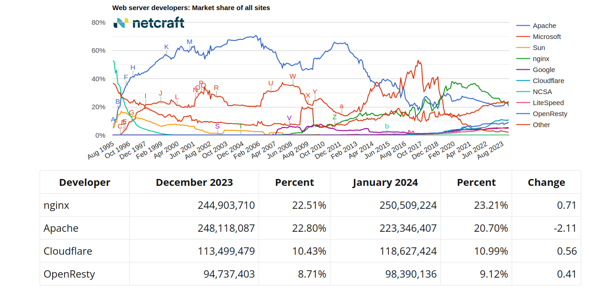


Breve historia de la World Wide Web.
Arquitectura general de la Web. Diseño.
El cliente web.
Servidores web.
Servidores de aplicaciones.
Servidores de bases de datos.
Servidores complementarios.
Infraestructura para los servicios.


## Breve Historia de la WWW
 La  www en la red World Wide Web 
Varios períodos en la historia de la web 

- **1980 – 1990**: Desarrollo del concepto de la web. Tim Berners-Lee introduce la idea de un sistema de información global basado en hipertexto.

- **1992 – 1995**: Expansión del uso de Internet. Creación de los primeros navegadores gráficos (como Mosaic) que permiten a los usuarios comunes interactuar con la web.

- **1996 – 1998**: Primeras etapas de comercio en la web. Comienza a surgir el comercio electrónico con empresas pioneras como Amazon y eBay.

- **1999 – 2001**: La burbuja de las empresas .com. El auge y colapso de muchas startups relacionadas con Internet que no tenían un modelo de negocio sostenible.

- **2002 – 2006: La expansión de la Web 2.0**:
    - **Web 2.0**: Este período marca el auge de la llamada Web 2.0, donde los usuarios pasan de ser meros consumidores de información a ser creadores de contenido. Plataformas como **MySpace** (2003), **Facebook** (2004) y **YouTube** (2005) introducen nuevas formas de interacción, centradas en la participación activa.
    - **Tecnologías clave**: Durante esta época se popularizan tecnologías como **AJAX**, que permite a los desarrolladores web crear aplicaciones más rápidas y dinámicas, mejorando la experiencia de usuario.
    - **Primeros pasos del comercio en la nube**: Aunque aún en su fase inicial, empresas como **Amazon** comienzan a ofrecer servicios en la nube, sentando las bases de lo que será la computación en la nube.

- **2007 – 2012: La revolución móvil y la nube**:
    - **El iPhone y el auge de los smartphones**: En 2007, el lanzamiento del **iPhone** revoluciona el acceso a la web. Los usuarios comienzan a conectarse a Internet desde dispositivos móviles a gran escala, y esto impulsa el diseño web responsivo.
    - **La explosión de las aplicaciones móviles**: A medida que los smartphones se convierten en una parte fundamental de la vida diaria, las aplicaciones móviles comienzan a competir con las páginas web en importancia. Servicios como **App Store** (2008) y **Google Play** (2008) permiten a los desarrolladores ofrecer aplicaciones directamente a los usuarios.
    - **Servicios en la nube**: En esta etapa, la computación en la nube empieza a consolidarse con la expansión de plataformas como **Amazon Web Services (AWS)** (2006), que ofrece infraestructura escalable para aplicaciones web.

- **2013 – 2017: La era del Big Data y la privacidad**:
    - **Big Data**: El crecimiento de los servicios en línea genera enormes cantidades de datos, lo que lleva al auge de tecnologías de análisis masivo de datos o **Big Data**. Empresas como Google y Facebook comienzan a aprovechar estos datos para personalizar la experiencia web, aunque esto suscita debates sobre la privacidad de los usuarios.
    - **Auge de las redes sociales**: Redes sociales como **Instagram** (2010), **WhatsApp** (2010) y **Snapchat** (2011) dominan el panorama digital, cambiando la forma en que los usuarios interactúan entre sí y con la web.
    - **Ciberseguridad y privacidad**: Los crecientes ataques cibernéticos y la recopilación masiva de datos provocan que la seguridad se convierta en una prioridad. Esto lleva a la adopción del protocolo **HTTPS** en la mayoría de los sitios web y al desarrollo de regulaciones de protección de datos como el **GDPR** en Europa.

- **2018 – Actualidad: Inteligencia artificial y descentralización**:
    - **Inteligencia artificial y machine learning**: Tecnologías de IA y **machine learning** comienzan a integrarse en la web para mejorar desde los motores de búsqueda hasta las recomendaciones en plataformas de streaming y redes sociales.
    - **Blockchain y Web 3.0**: Empiezan a surgir conceptos de una **Web 3.0** basada en tecnologías descentralizadas como el **blockchain**, con el objetivo de dar más control a los usuarios sobre sus datos y las transacciones en línea.
    - **El auge de IoT**: La **Internet de las cosas (IoT)** continúa su expansión, conectando millones de dispositivos al entorno web y transformando sectores como el hogar inteligente, la industria y la salud.
    - **Impacto de la pandemia (COVID-19)**: La pandemia global de 2020 acelera la digitalización de muchos sectores, aumentando la demanda de aplicaciones web, comercio electrónico y servicios en línea.

 Perspectivas de presente y futuro 

- **Auge de las tecnologías móviles**: La web se adapta a los dispositivos móviles, como teléfonos inteligentes y tabletas, que ahora dominan el acceso a Internet.

- **Internet de las Cosas (IoT)**: La integración de la web con dispositivos cotidianos, conectándolos a Internet para mejorar la automatización y la comunicación entre dispositivos.

## Arquitectura

Puedes ampliar la idea de la siguiente manera:

 La arquitectura de la WWW es un tanto compleja  y, sobre todo,  muy vasta . 

Abarca una gran cantidad de elementos interconectados, desde el hardware que sustenta los servidores hasta los diversos protocolos y tecnologías que permiten la comunicación fluida entre los navegadores y los servidores.

Esta arquitectura incluye múltiples capas, como la física, la de red, la de transporte, y finalmente la aplicación, donde operan los servicios web que utilizamos a diario.

Sin embargo, pese a su complejidad, podemos simplificar la explicación para comprender mejor su funcionamiento básico.

Para centrarnos, vamos a exponer el proceso que ocurre en una solicitud de una página web que podemos ver en la siguiente images:




 Esquema del Proceso de Solicitud de una Página Web 

1. **Navegador del cliente**:
  - El usuario introduce una URL en el navegador web (ejemplo: `www.ejemplo.com`).

2. **Consulta DNS**:
  - El navegador envía una solicitud al **servidor DNS** para obtener la dirección IP correspondiente al nombre de dominio.

3. **Petición HTTP/HTTPS**:
  - El navegador realiza una solicitud **HTTP/HTTPS** a la dirección IP obtenida, pidiendo el recurso (una página web, archivo, etc.).

4. **Servidor Web**:
  - El **servidor web** (como Apache o Nginx) recibe la solicitud y verifica el recurso solicitado.

5. **Servidor de Aplicaciones** (si aplica):
  - Si la página requiere procesamiento dinámico (PHP, Java, Python, etc.), el **servidor de aplicaciones** genera el contenido necesario.

6. **Servidor de Bases de Datos** (si aplica):
  - Si es necesario, el servidor de aplicaciones consulta el **servidor de bases de datos** para obtener datos (ejemplo: contenido de un blog, productos de una tienda).

7. **Respuesta del Servidor**:
  - El servidor web envía el contenido solicitado de vuelta al navegador, ya sea una página estática o dinámica.

8. **Renderizado en el Navegador**:
  - El navegador interpreta el HTML, CSS y JavaScript recibidos, y muestra la página al usuario.


- **Caché**: Dependiendo de la configuración, el navegador o un servicio intermedio (CDN, caché del servidor) puede almacenar una copia temporal del recurso para acelerar solicitudes futuras.



### Servidores web.
[En esta página de netcraft](https://www.netcraft.com/blog/january-2024-web-server-survey/),  podemos ver un análisis mensual de la cuota de mercado de servidores web, basado en el número de sitios web, dominios y computadoras activas. 

Como podemos ver en la imagen,  en enero de 2024 , el estudio reporta cambios en la popularidad de servidores como  nginx (23.21% de los sitios web) y Apache (20.70%) . 
También incluye información sobre el crecimiento de Cloudflare y OpenResty, así como actualizaciones sobre software relevante para servidores.

#### Servidor Web: Algunas Características

- **Contenido estático y dinámico**: Soporte para contenido estático (HTML) y dinámico (mediante CGI, intérpretes de PHP, Python, etc.).
- **Host virtuales**: Permite manejar varias direcciones web desde una única dirección IP.
- **Velocidad de respuesta**: Autoregulación de la velocidad de respuesta según la demanda.
- **Autenticación básica**: Integración con sistemas de autenticación para acceso restringido.
- **Soporte de SSL**: Capacidad de cifrar la comunicación mediante HTTPS.
- **Módulos**: Extensible mediante módulos para soporte de nuevas características.

---

### Servidor de Aplicaciones

- Un servidor de aplicaciones es un paquete de software que proporciona servicios a las aplicaciones, como:
  - **Seguridad**
  - **Balanceo de carga**
  - **Gestión de sistemas distribuidos**

- Inicialmente, estos servidores aparecieron en la plataforma **Java**, pero hoy en día se usan para todo tipo de tecnologías.
- Los servidores web y de aplicaciones suelen trabajar juntos, aunque son diferentes. Un servidor de aplicaciones necesita de un servidor web para funcionar.



---

### Servidor de Bases de Datos

- **Tipos de bases de datos**:
  - **Relacionales**: MySQL, Oracle, SQLServer, MariaDB
  - **No relacionales**: MongoDB

---

### Servidores Complementarios

- **Correo**:
  - Servidores como **Postfix** o **Sendmail**.
  - Extensiones como **SPF** para verificación y control de SPAM.
  - Generalmente se delega al proveedor del servicio.

- **DNS**:
  - Servidores como **Bind** gestionan la resolución de nombres en Internet.
  - También puede ser gestionado por el proveedor.

---

### Servidores Complementarios: Proxies

- Un **proxy** actúa como intermediario entre el cliente y el servidor web.

  - **Proxy directo**:
    - Mejora la eficiencia y seguridad al controlar el acceso a redes externas.
    - Ofrece funcionalidades de caché y autenticación.

  - **Proxy inverso**:
    - Se coloca entre el cliente y los servidores internos.
    - Permite balancear la carga entre varios servidores.
    - Mejora el rendimiento al ofrecer caché.
    - Un proxy inverso puede servir múltiples servidores desde la misma URI.

---

### Infraestructura Hardware

- **Cloud Computing**:
  - Se basa en la provisión de servicios informáticos a través de la nube, sin depender de dispositivos específicos.
  - Ventajas:
    - **Agilidad**: Mejores recursos para el usuario.
    - **Coste**: Reducidos en comparación con infraestructura física.
    - **Escalabilidad**: Ajuste de recursos según demanda.
    - **Rendimiento mejorado**.

  - Desventajas:
    - Dependencia de la conexión a Internet.
    - Los datos sensibles pueden no estar completamente bajo el control de la empresa.
    - Curvas de aprendizaje elevadas debido a cambios continuos en la tecnología.

---

### Modelos de Servicios Cloud

- **IaaS (Infrastructure as a Service)**:
  - Provisión de recursos físicos y virtuales, como máquinas virtuales, almacenamiento, y balanceadores de carga.
  - Se usan hipervisores como **Xen**, **KVM**, **VMware ESX/ESXi** o **Hyper-V**.
  - Ejemplos: **Amazon EC2**, **Azure VM**, **OpenStack**.

- **PaaS (Platform as a Service)**:
  - Permite desarrollar, ejecutar y gestionar aplicaciones sin preocuparse por la infraestructura.
  - Se puede ejecutar sobre IaaS, máquinas físicas o contenedores.
  - Ejemplos: **Google App Engine**, **OpenShift**, **Heroku**.

- **SaaS (Software as a Service)**:
  - Aplicaciones disponibles a través de Internet.
  - Ejemplos: **Google Docs**, **Dropbox**, **Twitter**, **Netflix**.

- **CaaS (Container as a Service)**:
  - Nuevo concepto entre IaaS y PaaS, basado en el uso de contenedores.
  - Permite desplegar aplicaciones sin necesidad de virtualización completa.
  - Ejemplos: **Docker**, **OpenStack Magnum**, **Kubernetes**, **Rancher**:
  
    - **Docker**: Es una plataforma de contenedores que permite empaquetar aplicaciones y todas sus dependencias en contenedores ligeros. Facilita la portabilidad entre entornos y el despliegue rápido de aplicaciones, tanto en desarrollo como en producción.

    - **Kubernetes**: Es una plataforma de orquestación de contenedores que automatiza el despliegue, escalado y operación de aplicaciones en contenedores. Facilita la gestión de múltiples contenedores en clústeres, distribuyendo la carga y asegurando alta disponibilidad.

    - **OpenStack Magnum**: Es una solución de OpenStack para gestionar contenedores mediante orquestadores como Kubernetes o Docker Swarm, integrándose en infraestructuras OpenStack.

    - **Rancher**: Es una plataforma que simplifica la gestión de Kubernetes y contenedores, ofreciendo una interfaz intuitiva para gestionar clústeres Kubernetes en múltiples entornos (nubes, servidores físicos).
